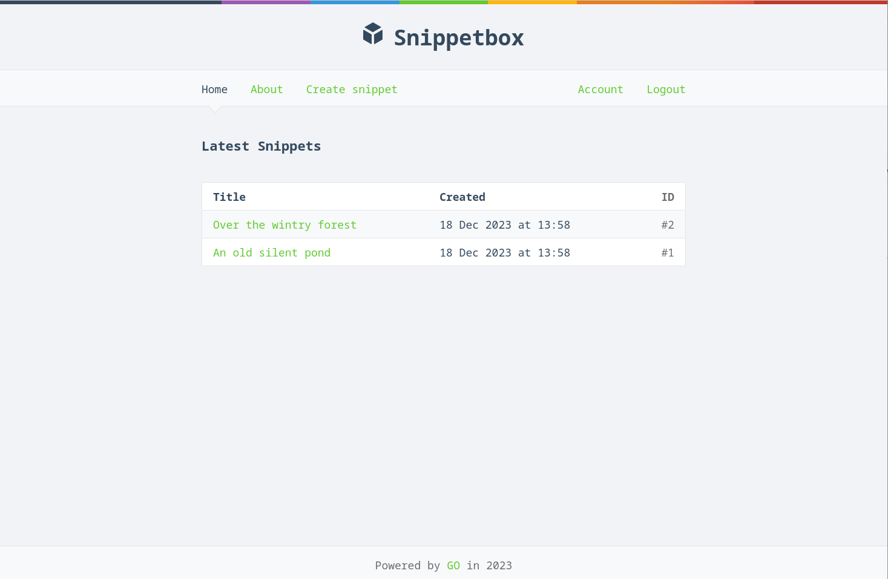

# Snippet box

Snippetbox is a web-application, which lets people paste and share snippets of text — a bit like Pastebin or GitHub’s Gists.




### Features

- Authentication. Users can register and sign in.
- Protected endpoints. Only signed-in users can create snippets.
- RESTful routing.
- Middleware.
- MySQL database.
- SSL/TLS web server using HTTP 2.0.
- Generated HTML via Golang templates.
- CRSF protection.

### Development

Generate a self signed https certificate:
```
$ mkdir tls
$ cd tls
$ go run /usr/local/go/src/crypto/tls/generate_cert.go --rsa-bits=2048 --host=localhost
```

Run the app:
```
go run cmd/web
```

Starts the local web server with HTTPS on port 4000 ([https://localhost:4000](https://localhost:4000))
